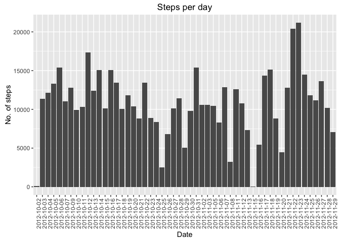
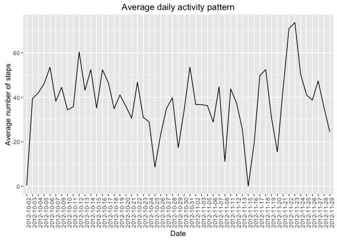
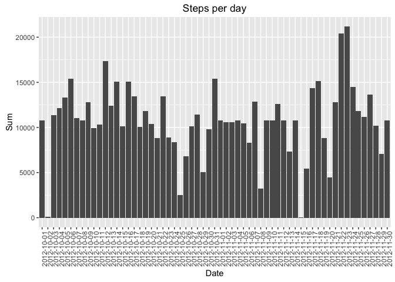
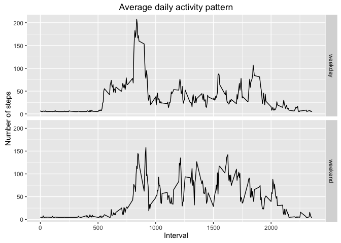

# Reproducible Research: Peer Assessment 1
###Session information
Below is the basic information about the computer and R packages that are loaded when performing this analysis.

```
## R version 3.3.0 (2016-05-03)
## Platform: x86_64-apple-darwin13.4.0 (64-bit)
## Running under: OS X 10.10.1 (Yosemite)
## 
## locale:
## [1] C
## 
## attached base packages:
## [1] stats     graphics  grDevices utils     datasets  methods   base     
## 
## loaded via a namespace (and not attached):
##  [1] magrittr_1.5    formatR_1.4     tools_3.3.0     htmltools_0.3.5
##  [5] yaml_2.1.13     Rcpp_0.12.5     stringi_1.1.1   rmarkdown_0.9.6
##  [9] knitr_1.13      stringr_1.0.0   digest_0.6.9    evaluate_0.9
```

## Loading and preprocessing the data
#### Load the data

```r
unzip("activity.zip")
dat <- read.csv(file="activity.csv",sep=",",header=TRUE)
```

## What is mean total number of steps taken per day?
#### 1. Calculate the total number of steps taken per day

```r
dats <- aggregate(steps~date,dat,sum)
names(dats) <- c("Date","Sum_of_steps")
dats
```

```
##          Date Sum_of_steps
## 1  2012-10-02          126
## 2  2012-10-03        11352
## 3  2012-10-04        12116
## 4  2012-10-05        13294
## 5  2012-10-06        15420
## 6  2012-10-07        11015
## 7  2012-10-09        12811
## 8  2012-10-10         9900
## 9  2012-10-11        10304
## 10 2012-10-12        17382
## 11 2012-10-13        12426
## 12 2012-10-14        15098
## 13 2012-10-15        10139
## 14 2012-10-16        15084
## 15 2012-10-17        13452
## 16 2012-10-18        10056
## 17 2012-10-19        11829
## 18 2012-10-20        10395
## 19 2012-10-21         8821
## 20 2012-10-22        13460
## 21 2012-10-23         8918
## 22 2012-10-24         8355
## 23 2012-10-25         2492
## 24 2012-10-26         6778
## 25 2012-10-27        10119
## 26 2012-10-28        11458
## 27 2012-10-29         5018
## 28 2012-10-30         9819
## 29 2012-10-31        15414
## 30 2012-11-02        10600
## 31 2012-11-03        10571
## 32 2012-11-05        10439
## 33 2012-11-06         8334
## 34 2012-11-07        12883
## 35 2012-11-08         3219
## 36 2012-11-11        12608
## 37 2012-11-12        10765
## 38 2012-11-13         7336
## 39 2012-11-15           41
## 40 2012-11-16         5441
## 41 2012-11-17        14339
## 42 2012-11-18        15110
## 43 2012-11-19         8841
## 44 2012-11-20         4472
## 45 2012-11-21        12787
## 46 2012-11-22        20427
## 47 2012-11-23        21194
## 48 2012-11-24        14478
## 49 2012-11-25        11834
## 50 2012-11-26        11162
## 51 2012-11-27        13646
## 52 2012-11-28        10183
## 53 2012-11-29         7047
```
#### 2. Histogram of the total number of steps taken each day

```r
library(ggplot2)
g <- ggplot(dats,aes(x=Date,y=Sum_of_steps))
g <- g + geom_bar(stat="identity",position="dodge")
g <- g + theme(axis.text.x = element_text(angle = 90, hjust = 1))
g <- g+labs(title="Steps per day",x="Date",y="No. of steps")
g
```

<!-- -->

#### 3. Calculate and report the mean and median of the total number of steps taken per day
Mean of the number of steps each day

```r
datm <- aggregate(steps~date,dat,mean)
dats$Mean <- datm$steps
dats
```

```
##          Date Sum_of_steps       Mean
## 1  2012-10-02          126  0.4375000
## 2  2012-10-03        11352 39.4166667
## 3  2012-10-04        12116 42.0694444
## 4  2012-10-05        13294 46.1597222
## 5  2012-10-06        15420 53.5416667
## 6  2012-10-07        11015 38.2465278
## 7  2012-10-09        12811 44.4826389
## 8  2012-10-10         9900 34.3750000
## 9  2012-10-11        10304 35.7777778
## 10 2012-10-12        17382 60.3541667
## 11 2012-10-13        12426 43.1458333
## 12 2012-10-14        15098 52.4236111
## 13 2012-10-15        10139 35.2048611
## 14 2012-10-16        15084 52.3750000
## 15 2012-10-17        13452 46.7083333
## 16 2012-10-18        10056 34.9166667
## 17 2012-10-19        11829 41.0729167
## 18 2012-10-20        10395 36.0937500
## 19 2012-10-21         8821 30.6284722
## 20 2012-10-22        13460 46.7361111
## 21 2012-10-23         8918 30.9652778
## 22 2012-10-24         8355 29.0104167
## 23 2012-10-25         2492  8.6527778
## 24 2012-10-26         6778 23.5347222
## 25 2012-10-27        10119 35.1354167
## 26 2012-10-28        11458 39.7847222
## 27 2012-10-29         5018 17.4236111
## 28 2012-10-30         9819 34.0937500
## 29 2012-10-31        15414 53.5208333
## 30 2012-11-02        10600 36.8055556
## 31 2012-11-03        10571 36.7048611
## 32 2012-11-05        10439 36.2465278
## 33 2012-11-06         8334 28.9375000
## 34 2012-11-07        12883 44.7326389
## 35 2012-11-08         3219 11.1770833
## 36 2012-11-11        12608 43.7777778
## 37 2012-11-12        10765 37.3784722
## 38 2012-11-13         7336 25.4722222
## 39 2012-11-15           41  0.1423611
## 40 2012-11-16         5441 18.8923611
## 41 2012-11-17        14339 49.7881944
## 42 2012-11-18        15110 52.4652778
## 43 2012-11-19         8841 30.6979167
## 44 2012-11-20         4472 15.5277778
## 45 2012-11-21        12787 44.3993056
## 46 2012-11-22        20427 70.9270833
## 47 2012-11-23        21194 73.5902778
## 48 2012-11-24        14478 50.2708333
## 49 2012-11-25        11834 41.0902778
## 50 2012-11-26        11162 38.7569444
## 51 2012-11-27        13646 47.3819444
## 52 2012-11-28        10183 35.3576389
## 53 2012-11-29         7047 24.4687500
```

Median of total number of steps taken per day?

```r
datm <- aggregate(steps~date,dat,median)
dats$Median <- datm$steps
dats
```

```
##          Date Sum_of_steps       Mean Median
## 1  2012-10-02          126  0.4375000      0
## 2  2012-10-03        11352 39.4166667      0
## 3  2012-10-04        12116 42.0694444      0
## 4  2012-10-05        13294 46.1597222      0
## 5  2012-10-06        15420 53.5416667      0
## 6  2012-10-07        11015 38.2465278      0
## 7  2012-10-09        12811 44.4826389      0
## 8  2012-10-10         9900 34.3750000      0
## 9  2012-10-11        10304 35.7777778      0
## 10 2012-10-12        17382 60.3541667      0
## 11 2012-10-13        12426 43.1458333      0
## 12 2012-10-14        15098 52.4236111      0
## 13 2012-10-15        10139 35.2048611      0
## 14 2012-10-16        15084 52.3750000      0
## 15 2012-10-17        13452 46.7083333      0
## 16 2012-10-18        10056 34.9166667      0
## 17 2012-10-19        11829 41.0729167      0
## 18 2012-10-20        10395 36.0937500      0
## 19 2012-10-21         8821 30.6284722      0
## 20 2012-10-22        13460 46.7361111      0
## 21 2012-10-23         8918 30.9652778      0
## 22 2012-10-24         8355 29.0104167      0
## 23 2012-10-25         2492  8.6527778      0
## 24 2012-10-26         6778 23.5347222      0
## 25 2012-10-27        10119 35.1354167      0
## 26 2012-10-28        11458 39.7847222      0
## 27 2012-10-29         5018 17.4236111      0
## 28 2012-10-30         9819 34.0937500      0
## 29 2012-10-31        15414 53.5208333      0
## 30 2012-11-02        10600 36.8055556      0
## 31 2012-11-03        10571 36.7048611      0
## 32 2012-11-05        10439 36.2465278      0
## 33 2012-11-06         8334 28.9375000      0
## 34 2012-11-07        12883 44.7326389      0
## 35 2012-11-08         3219 11.1770833      0
## 36 2012-11-11        12608 43.7777778      0
## 37 2012-11-12        10765 37.3784722      0
## 38 2012-11-13         7336 25.4722222      0
## 39 2012-11-15           41  0.1423611      0
## 40 2012-11-16         5441 18.8923611      0
## 41 2012-11-17        14339 49.7881944      0
## 42 2012-11-18        15110 52.4652778      0
## 43 2012-11-19         8841 30.6979167      0
## 44 2012-11-20         4472 15.5277778      0
## 45 2012-11-21        12787 44.3993056      0
## 46 2012-11-22        20427 70.9270833      0
## 47 2012-11-23        21194 73.5902778      0
## 48 2012-11-24        14478 50.2708333      0
## 49 2012-11-25        11834 41.0902778      0
## 50 2012-11-26        11162 38.7569444      0
## 51 2012-11-27        13646 47.3819444      0
## 52 2012-11-28        10183 35.3576389      0
## 53 2012-11-29         7047 24.4687500      0
```


## What is the average daily activity pattern?
#### 1. Time series plot

```r
g <- qplot(Date,Mean,data=dats,geom="line",group=1)
g <- g + theme(axis.text.x = element_text(angle = 90, hjust = 1))
g <- g+labs(title="Average daily activity pattern",x="Date",y="Average number of steps")
g
```

<!-- -->

#### 2. Which 5-minute interval that, on average, contains the maximum number of steps?

```r
x <- dat$steps
maxval <- dat[which(x==max(dat$steps,na.rm=TRUE)),]
starttime <- as.POSIXlt(paste(maxval$date,"12:00:00"))
endtime <- starttime+maxval$interval
resultDate <- maxval$date
resultSteps <- maxval$steps
resultEnd <- format(endtime,"%H:%M:%S")
resultStart <- format(endtime-5,"%H:%M:%S")
```
The 5-minute interval that, on average, contains the maximum number of steps was on 2012-11-27 between 12:10:10 and 12:10:15. The max. number of steps where 806.

## Imputing missing values
#### 1. Calculate and report the total number of missing values in the dataset

```r
num <- sum(is.na(dat$steps))
```
The total number of missing values in the dataset is 2304

#### 2. Strategy for filling missing values is to fill them by the mean of the total number of steps per day. If the mean of the total number of steps per day is also missing, then replace by mean of the total steps in the sample.

```r
datmod <- dat
datdup <- dat
datmod[is.na(datmod)]<-mean(dat$steps,na.rm=TRUE)
datmods <- aggregate(steps~date,datmod,mean)
for(i in 1:nrow(datdup)){
    if (is.na(datdup[i,1])){
        datdup[i,1] <- datmods[which(as.factor(datmods$date) %in% datdup[i,2]),2]
    }
}
```
###3. Create a new dataset that is equal to the original dataset but with the missing data filled in.
Below the dataset is derived. Since its huge, same is not displayed. Instead the details of Sum, Mean, Median for each day derived from the new dataset is displayed

```r
datmods <- aggregate(steps~date,datdup,sum)
names(datmods) <- c("Date","Sum")
datmodstemp <- aggregate(steps~date,datdup,mean)
datmods$Mean <- datmodstemp$steps
atmodstemp <- aggregate(steps~date,datdup,median)
datmods$Median <- datmodstemp$steps
datmods
```

```
##          Date      Sum       Mean     Median
## 1  2012-10-01 10766.19 37.3825996 37.3825996
## 2  2012-10-02   126.00  0.4375000  0.4375000
## 3  2012-10-03 11352.00 39.4166667 39.4166667
## 4  2012-10-04 12116.00 42.0694444 42.0694444
## 5  2012-10-05 13294.00 46.1597222 46.1597222
## 6  2012-10-06 15420.00 53.5416667 53.5416667
## 7  2012-10-07 11015.00 38.2465278 38.2465278
## 8  2012-10-08 10766.19 37.3825996 37.3825996
## 9  2012-10-09 12811.00 44.4826389 44.4826389
## 10 2012-10-10  9900.00 34.3750000 34.3750000
## 11 2012-10-11 10304.00 35.7777778 35.7777778
## 12 2012-10-12 17382.00 60.3541667 60.3541667
## 13 2012-10-13 12426.00 43.1458333 43.1458333
## 14 2012-10-14 15098.00 52.4236111 52.4236111
## 15 2012-10-15 10139.00 35.2048611 35.2048611
## 16 2012-10-16 15084.00 52.3750000 52.3750000
## 17 2012-10-17 13452.00 46.7083333 46.7083333
## 18 2012-10-18 10056.00 34.9166667 34.9166667
## 19 2012-10-19 11829.00 41.0729167 41.0729167
## 20 2012-10-20 10395.00 36.0937500 36.0937500
## 21 2012-10-21  8821.00 30.6284722 30.6284722
## 22 2012-10-22 13460.00 46.7361111 46.7361111
## 23 2012-10-23  8918.00 30.9652778 30.9652778
## 24 2012-10-24  8355.00 29.0104167 29.0104167
## 25 2012-10-25  2492.00  8.6527778  8.6527778
## 26 2012-10-26  6778.00 23.5347222 23.5347222
## 27 2012-10-27 10119.00 35.1354167 35.1354167
## 28 2012-10-28 11458.00 39.7847222 39.7847222
## 29 2012-10-29  5018.00 17.4236111 17.4236111
## 30 2012-10-30  9819.00 34.0937500 34.0937500
## 31 2012-10-31 15414.00 53.5208333 53.5208333
## 32 2012-11-01 10766.19 37.3825996 37.3825996
## 33 2012-11-02 10600.00 36.8055556 36.8055556
## 34 2012-11-03 10571.00 36.7048611 36.7048611
## 35 2012-11-04 10766.19 37.3825996 37.3825996
## 36 2012-11-05 10439.00 36.2465278 36.2465278
## 37 2012-11-06  8334.00 28.9375000 28.9375000
## 38 2012-11-07 12883.00 44.7326389 44.7326389
## 39 2012-11-08  3219.00 11.1770833 11.1770833
## 40 2012-11-09 10766.19 37.3825996 37.3825996
## 41 2012-11-10 10766.19 37.3825996 37.3825996
## 42 2012-11-11 12608.00 43.7777778 43.7777778
## 43 2012-11-12 10765.00 37.3784722 37.3784722
## 44 2012-11-13  7336.00 25.4722222 25.4722222
## 45 2012-11-14 10766.19 37.3825996 37.3825996
## 46 2012-11-15    41.00  0.1423611  0.1423611
## 47 2012-11-16  5441.00 18.8923611 18.8923611
## 48 2012-11-17 14339.00 49.7881944 49.7881944
## 49 2012-11-18 15110.00 52.4652778 52.4652778
## 50 2012-11-19  8841.00 30.6979167 30.6979167
## 51 2012-11-20  4472.00 15.5277778 15.5277778
## 52 2012-11-21 12787.00 44.3993056 44.3993056
## 53 2012-11-22 20427.00 70.9270833 70.9270833
## 54 2012-11-23 21194.00 73.5902778 73.5902778
## 55 2012-11-24 14478.00 50.2708333 50.2708333
## 56 2012-11-25 11834.00 41.0902778 41.0902778
## 57 2012-11-26 11162.00 38.7569444 38.7569444
## 58 2012-11-27 13646.00 47.3819444 47.3819444
## 59 2012-11-28 10183.00 35.3576389 35.3576389
## 60 2012-11-29  7047.00 24.4687500 24.4687500
## 61 2012-11-30 10766.19 37.3825996 37.3825996
```
###4. Histogram with the new dataset

```r
library(ggplot2)
g <- ggplot(datmods,aes(x=Date,y=Sum))
g <- g + geom_bar(stat="identity",position="dodge")
g <- g + theme(axis.text.x = element_text(angle = 90, hjust = 1))
g <- g+labs(title="Steps per day",x="Date",y="Sum")
g
```

<!-- -->

The difference between both histograms is that there are no more dates where the plot if not available for missing values.The total daily number of steps increases by imputing missing values. 

## Are there differences in activity patterns between weekdays and weekends?

```r
datdup$Day <- weekdays(as.POSIXlt(datdup$date))
for(i in 1:nrow(datdup)){
    x <- datdup[i,4] 
    if(x=="Saturday" || x=="Sunday")
    {
        datdup[i,4] <- "weekend"
    }
    else
    {
        datdup[i,4] <- "weekday"
    }
}
ds <- aggregate(steps~interval+Day,datdup,mean)
names(ds) <- c("Interval","Day","Mean")
g <- qplot(Interval,Mean,data=ds,geom="line",group=1)
g <- g+labs(title="Average daily activity pattern",x="Interval",y="Number of steps")
g <- g+facet_grid(Day ~ .)
g
```

<!-- -->

Yes, there is a difference between the activity patterns between weekend and weekdays


